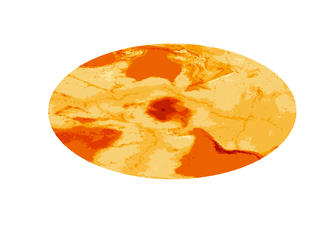
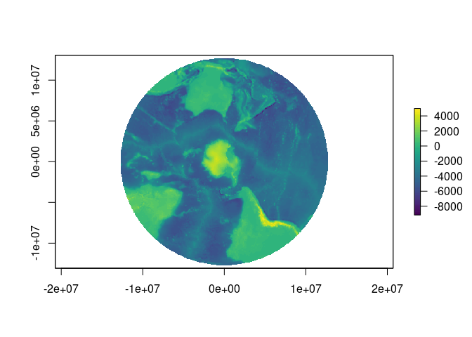

<!-- README.md is generated from README.Rmd. Please edit that file -->

# quadmesh 

[](https://www.tidyverse.org/lifecycle/#maturing)[](https://travis-ci.org/hypertidy/quadmesh)
[](https://travis-ci.org/hypertidy/quadmesh)
[](https://ci.appveyor.com/project/mdsumner/quadmesh-x25a2)
[](https://codecov.io/github/hypertidy/quadmesh?branch=master)
[](https://cran.r-project.org/package=quadmesh)[](https://cran.r-project.org/package=quadmesh)

A *quadmesh* is a dense mesh describing a topologically continuous
surface of 4-corner primitives. This is also known as a *cell-based
raster* but in those contexts the corner coordinates and the continuous
nature of the mesh is completely implicit. By making the *dense mesh*
explicit we have access to every corner coordinate (not just the
centres) which allows for some extra facilities over raster grids.

This package provides helpers for working with this mesh interpretation
of gridded data to enable

  - arbitrary reprojection of raster cells without information loss
    (`mesh_plot`).
  - the corner-based *continuous* interpretation of a grid
    (`quadmesh()`).
  - the centre-based *continuous* interpretation of a grid
    (`triangmesh()`).
  - the corner-based *discrete* interpretation of a grid
    (`dquadmesh()`).
  - the centre-based *discrete* interpretation of a grid
    (`dtriangmesh()`).
  - easy plotting of grids in 3D visualization tools (quad or triangle
    primitives for `rgl::shade3d`).
  - fast polygonization of individual cells, in
    [spex::polygonize](https://CRAN.R-project.org/package=spex).
  - barycentric interpolation from a triangle mesh (`bary_index()`).
  - conversion from quad to triangle primitives from the area
    interpretation (`triangulate_quads()`).

## Installation

You can install:

  - the latest released version from CRAN with

<!-- end list -->

``` r
install.packages("quadmesh")
```

  - the latest development version from Github with

<!-- end list -->

``` r
## install.packages("remotes")
remotes::install_github("hypertidy/quadmesh")
```

## Examples

Quadmesh provides a number of key features that are not readily
available to more commonly used geospatial applications.

### The corner-based interpretation of a grid

In raster there is an implicit “area-based” interpretion of the extent
and value of every cell. Coordinates are implicit, and centre-based but
the `extent` reflects a finite and constant width and height.

``` r
library(quadmesh)
library(raster)
#> Loading required package: sp
r <- raster(matrix(1:12, 3), xmn = 0, xmx = 4, ymn = 0, ymx = 3)
qm <- quadmesh(r)

op <- par(xpd = NA)
plot(extent(r) + 0.5, type = "n", axes = FALSE, xlab = "", ylab = "")
plot(r, col = rep(c("palevioletred3", "aliceblue"), 6), add = TRUE)
text(coordinates(r), lab = seq_len(ncell(r)))
plot(extent(r), add = TRUE)

## with quadmesh there are 20 corner coordinates
points(t(qm$vb[1:2, ]), pch = "x", cex = 2)
```

<!-- -->

``` r
par(op)
```

Every individual quad is described implicitly by index into the unique
corner coordinates. This format is built upon the `mesh3d` class of the
`rgl` package.

``` r
## coordinates, transpose here
qm$vb[1:2, ]
#>   [,1] [,2] [,3] [,4] [,5] [,6] [,7] [,8] [,9] [,10] [,11] [,12] [,13]
#> x    0    1    2    3    4    0    1    2    3     4     0     1     2
#> y    3    3    3    3    3    2    2    2    2     2     1     1     1
#>   [,14] [,15] [,16] [,17] [,18] [,19] [,20]
#> x     3     4     0     1     2     3     4
#> y     1     1     0     0     0     0     0

## indexes, also transpose
qm$ib
#>      [,1] [,2] [,3] [,4] [,5] [,6] [,7] [,8] [,9] [,10] [,11] [,12]
#> [1,]    1    2    3    4    6    7    8    9   11    12    13    14
#> [2,]    2    3    4    5    7    8    9   10   12    13    14    15
#> [3,]    7    8    9   10   12   13   14   15   17    18    19    20
#> [4,]    6    7    8    9   11   12   13   14   16    17    18    19
```

This separation of geometry (the 20 unique corner coordinates) and
topology (12 sets of 4-index) is the key concept of a mesh and is found
in many domains that involve computer graphics and modelling.

### The centre-based interpretation of a grid

A quadmesh is centre-based, and each raster pixel occupies a little
rectangle, but the centre-based interpretation is better described by a
mesh of *triangles*.

Every centre point of the grid data is a node in this mesh, while the
inside corners with their ambiguous value from 4 neighbouring cells are
not explicit. Note that a triangulation can be top-left/bottom-right
aligned as here, or bottom-left/top-right aligned, or be a mixture.

``` r
op <- par(xpd = NA)
plot(extent(r) + 0.5, type = "n", axes = FALSE, xlab = "", ylab = "")
plot(r, col = rep(c("palevioletred3", "aliceblue"), 6), add = TRUE)

tri <- triangmesh(r)
points(t(tri$vb[1:2, ]))
polygon(t(tri$vb[1:2, head(as.vector(rbind(tri$it, NA)), -1)]))
```

<!-- -->

``` r
par(op)
```

### Conversion from quad to triangle primitives

Quads are trivially converted into triangle form by splitting each in
two. Note that this is different again from the centre-based triangle
interpretation.

``` r
tri2 <- qm
tri2$it <- triangulate_quads(tri2$ib)
tri2$ib <- NULL
tri2$primtivetype <- "triangle"

op <- par(xpd = NA)
plot(extent(r) + 0.5, type = "n", axes = FALSE, xlab = "", ylab = "")
plot(r, col = rep(c("palevioletred3", "aliceblue"), 6), add = TRUE)


points(t(tri2$vb[1:2, ]))
polygon(t(tri2$vb[1:2, head(as.vector(rbind(tri2$it, NA)), -1)]), lwd = 2, lty = 2)
```

<!-- -->

### Arbitrary reprojection of raster cells

The in-built `etopo` data set is used to create a plot in a local map
projection. Here each cell is drawn by reprojecting it directly and
individually into this new coordinate system.

``` r
library(quadmesh)
library(raster)
## VicGrid
prj <- "+proj=lcc +lat_1=-36 +lat_2=-38 +lat_0=-37 +lon_0=145 +x_0=2500000 +y_0=2500000 +ellps=GRS80 +towgs84=0,0,0,0,0,0,0 +units=m +no_defs"
er <- crop(etopo, extent(110, 160, -50, -20))
system.time(mesh_plot(er, crs = prj))
#>    user  system elapsed 
#>   0.451   0.012   0.464

## This is faster to plot and uses much less data that converting explicitly to polygons. 

library(sf)
#> Linking to GEOS 3.7.0, GDAL 2.4.0, PROJ 5.2.0
p <- st_transform(spex::polygonize(er), prj)
plot(st_geometry(p), add = TRUE)
```

<!-- -->

``` r

system.time(plot(p, border = NA))
```

<!-- -->

    #>    user  system elapsed 
    #>   0.375   0.032   0.408
    pryr::object_size(er)
    #> 37.7 kB
    pryr::object_size(p)
    #> 1.68 MB
    pryr::object_size(quadmesh(er))
    #> 169 kB

The data size and timing benefits are more substantial for larger data
sets.

We get exactly what we asked for from `mesh_plot`, without the complete
remodelling of the data required by grid resampling.

``` r
pol <- "+proj=stere +lat_0=-90 +lon_0=147 +datum=WGS84"
mesh_plot(etopo, crs = pol)
```

<!-- -->

``` r
plot(projectRaster(etopo, crs = pol), col = viridis::viridis(64))
```

<!-- -->

### Easy 3D plotting of grids

The `quadmesh` and `triangmesh` types are extensions of the `rgl` class
`mesh3d`, and so are readily used by that package’s high level functions
such as `shade3d()` and `addNormals()`.

``` r
class(qm)
#> [1] "quadmesh" "mesh3d"   "shape3d"
class(tri)
#> [1] "triangmesh" "mesh3d"     "shape3d"
```

### Fast polygonization of individual cells

The `spex` package has functions `polygonize()` and
`qm_rasterToPolygons_sp()` which provide very fast conversion of raster
grids to a polygon layer with 5 explicit coordinates for every cell.
(`stars` and `sf` now provide an even faster version by using GDAL).

``` r
rr <- disaggregate(r, fact = 20)
system.time(spex::polygonize(rr))
#>    user  system elapsed 
#>   0.098   0.000   0.097
system.time(raster::rasterToPolygons(rr))
#>    user  system elapsed 
#>   1.178   0.001   1.178

## stars has now improved on spex by calling out to GDAL to do the work
system.time(sf::st_as_sf(stars::st_as_stars(rr), merge = FALSE, as_points = FALSE))
#>    user  system elapsed 
#>   0.103   0.000   0.103
```

### Barycentric interpolation from a triangle mesh

Using a triangulation version of a raster grid we can build an index of
weightings for a new of of arbitrary coordinates to estimate the
implicit value at each point as if there were continuous interpolation
across each primitive.

WIP - see `bary_index()` function.

## Development

Have feedback/ideas? Please let me know via
[issues](https://github.com/hypertidy/quadmesh/issues/).

Many aspects of this package have developed in conjunction with the
[angstroms
package](https://github.com/AustralianAntarcticDivision/angstroms) for
dealing with ROMS model output.

Please note that this project is released with a [Contributor Code of
Conduct](CODE_OF_CONDUCT.md). By participating in this project you agree
to abide by its terms.
